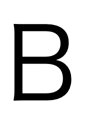
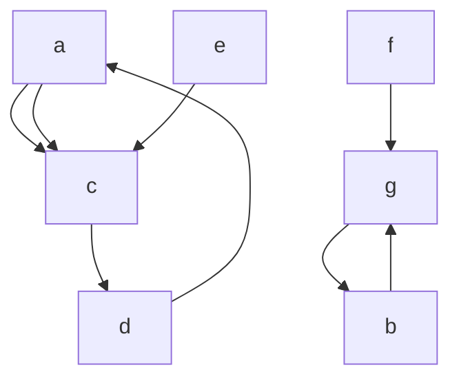

# hoge

## fuga

あいうえお

## piyo





## tasks

- [ ] あれをやる
- [x] これをやる

```python
def f(x, y):
  return x + y
```

```c++
int main(int argc, char** argv) {
    return 0;
}
```

```typescript
const f = (x: number, y: number): number => {
    return x + y;
}
```
