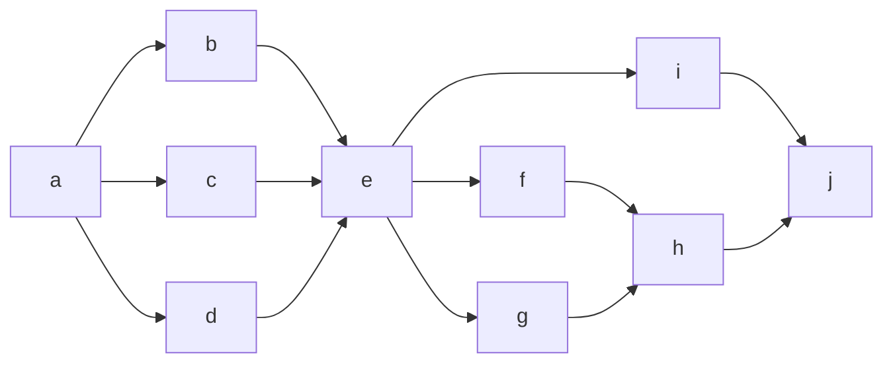

# edit markdown with livereload

## sentences

This is a sample text.

## graph by mermaid



## tasks

- [x] this is done
- [ ] this should be done
- [ ] ~this is cancelled~

## codes

### python

```python
def f(x, y):
  return x + y
```

### c++

```c++
int f(int x, int y){
  return x + y;
}
```

### typescript

``` typescript
const f = (x: number, y: number): number => {
    return x + y;
}
```

## table

| item1 | item2 |
|-------|-------|
| hoge  | fuga  |

## picture


